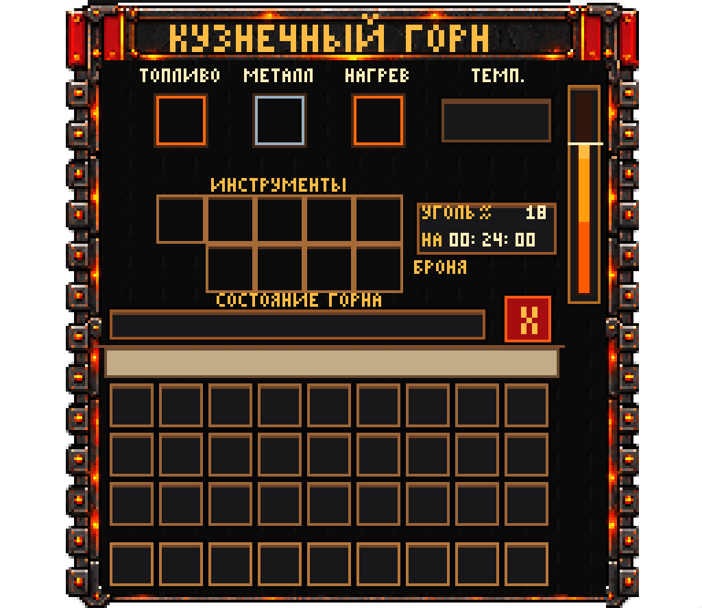
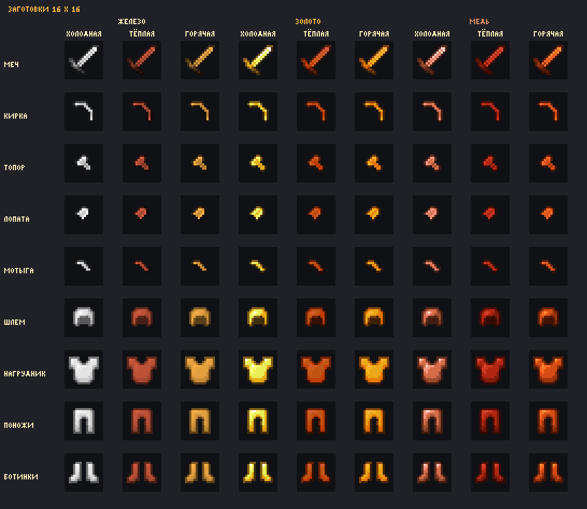

# ServerMine ForgeSystem

Кузнечная система для Minecraft: горн с собственным GUI, нагрев металла, мини-игра ковки, закалка и сборка предметов.


**Текущая версия:** 3.1.0 · **Проверенная среда:** Purpur 26.2 · **Java:** 25

[План развития](ROADMAP.md) · [Разработка](CONTRIBUTING.md) · [Архитектура](docs/DEVELOPMENT.md) · [История](docs/HISTORY.md)

## Возможности

- Железо, золото и медь; 9 изделий на металл: меч, кирка, топор, лопата, мотыга и четыре части брони.
- Горн с температурой, запасом топлива, повторным нагревом и отдельными входами для угля, слитков и заготовок.
- Три этапа ковки с зонами попадания, охлаждением и качеством результата.
- Заготовки в ванильном стиле 16×16: инструменты без деревянных рукоятей, броня с исходным силуэтом. 81 температурный вариант.
- Кузнечный молот 16×16, подписанные предметы и сохранение прогресса.
- Улучшение готового кованого железного снаряжения до алмазного на наковальне.
- Медное, железное, золотое и алмазное снаряжение исключено из верстака и автокрафтера; деревянные и каменные рецепты сохранены.
- Журнал восстановления и возврат предметов при закрытии GUI, выходе игрока и штатной остановке.
- Встроенный ресурспак и текстовый интерфейс при недоступности пакета.



*Это предпросмотр графики. Температура, топливо и предметы выводятся динамически в игре.*

<details>
<summary>Заготовки: железо, золото и медь, три температуры</summary>



</details>

## Сборка

Установите **JDK 25**, задайте `JAVA_HOME` и клонируйте репозиторий:

```sh
git clone https://github.com/PechenkaNowOOPS/ServerMine-ForgeSystem.git
cd ServerMine-ForgeSystem
```

Windows PowerShell:

```powershell
.\gradlew.bat build
```

Linux/macOS:

```sh
./gradlew build
```

Gradle Wrapper сам загрузит Gradle и зависимости. Локальный Maven-репозиторий не нужен. Генерация ресурспака входит в сборку.

Результаты:

- `build/libs/ServerMine-ForgeSystem-3.1.0.jar` — плагин со встроенным пакетом.
- `src/main/resources/forge.zip` — отдельный ресурспак, создаётся при сборке.
- `build/reports/tests/test/index.html` — отчёт JUnit.

GitHub Actions собирает эти же файлы при изменении `main` и в pull request. Готовые артефакты находятся в завершённом запуске на вкладке **Actions**.

## Установка

1. Штатно остановите сервер. Сохраните резервную копию каталога `plugins/ForgeSystem` и старого JAR.
2. Оставьте в `plugins` один JAR ForgeSystem новой версии. Старые отдельные плагины ForgeMinigame и ServerMine-ForgeGUI-Dynamic одновременно не устанавливайте.
3. Запустите сервер и выполните из консоли `forge status`, затем `forge selftest`.
4. Перезайдите клиентом для получения ресурспака.

Ключ `plugins/ForgeSystem/item-signing.key` нужен для чтения ранее выданных предметов. При переносе сервера сохраняйте его вместе с `state.yml` и настройками.

По умолчанию пакет раздаётся по `http://127.0.0.1:8127/forge.zip`: этот адрес подходит клиенту на том же компьютере. Для сетевого сервера задайте доступный игрокам адрес и bind в `plugins/ForgeSystem/resourcepack.yml` либо разместите ZIP на HTTP(S)-хостинге. Пакет добавляется к другим серверным ресурспакам.

## Как играть

1. Получите молот: `/forge hammer`. Для теста оператор может выполнить `/forge kit`.
2. Поставьте плавильную печь на кирпичный блок — стандартная форма горна.
3. Откройте горн **ПКМ молотом**. Загрузите уголь кнопкой-воронкой: **ЛКМ** — один предмет, **Shift+ЛКМ** — весь стак.
4. Дождитесь 900°C, поместите слитки в средний вход и выберите изделие **ЛКМ**.
5. Заготовку держите в левой руке, молот — в правой. **ПКМ по наковальне** запускает ковку; первый удар не оценивается. Следующие удары выполняйте при попадании ползунка в зону.
6. Остывшую заготовку нагрейте повторно через третий вход горна.
7. Незакалённую деталь возьмите в правую руку и нажмите **ПКМ по воде или котлу с водой**.
8. Броня готова сразу после закалки. Инструмент собирается **ПКМ по наковальне** с палками в левой руке: мечу нужна одна, остальным — две.

| Действие | Управление |
| --- | --- |
| Горн, ковка, закалка, сборка в мире | ПКМ |
| Кнопки внутри GUI | ЛКМ |
| Весь стак топлива | Shift+ЛКМ |
| Перемещение предметов в инвентаре | Стандартное Minecraft |

## Команды и настройки

### Алмазное улучшение

Возьмите **готовое кованое железное** изделие в правую руку, обычные алмазы — в левую, затем нажмите **ПКМ по наковальне**. Подходят все три состояния наковальни. Обычные железные предметы, заготовки, медь, золото и уже улучшенное снаряжение не принимаются.

| Изделие | Алмазы |
| --- | --- |
| Меч / мотыга | 2 |
| Кирка / топор | 3 |
| Лопата | 1 |
| Шлем | 5 |
| Нагрудник | 8 |
| Поножи | 7 |
| Ботинки | 4 |

Сохраняются UUID, автор, качество, этапы, имя и зачарования. Доля износа переносится на алмазный предмет с округлением повреждения вверх; улучшение не чинит предмет. Списание алмазов и замена предмета проходят одной операцией журнала. Старые кованые железные предметы можно улучшать без перевыдачи.

Из книги рецептов удаляются рецепты 36 типов снаряжения: 9 изделий каждого из четырёх материалов. Получение таких результатов через сетку крафта (включая ремонт в сетке) и автокрафтер также блокируется. Остальные рецепты, включая дерево, камень, кожу, блоки металлов, щиты и ножницы, сохраняются. Существующие предметы из инвентарей не удаляются.

Алмазный уровень входит в подпись предмета; старые подписи обычных кузнечных изделий совместимы. При откате на 3.0.8 новые алмазные изделия больше не будут распознаваться старым плагином — для отката используйте согласованную резервную копию сервера.

### Справочник команд

| Команда | Назначение |
| --- | --- |
| `/forge help` | Подсказка по ковке |
| `/forge open` | Открыть горн под прицелом с молотом в руке |
| `/forge claim` | Вернуть предметы, которым не хватило места |
| `/forge inspect` | Информация о кузнечном предмете в руке |
| `/forge stop` | Остановить текущую ковку |
| `/forge hammer`, `/forge kit` | Выдать молот / тестовый набор, администратор |
| `/forge status`, `/forge selftest` | Диагностика, администратор или консоль |
| `/forge reload` | Проверить и применить настройки, администратор |
| `/forge hot`, `/forge migrate` | Тестовый нагрев / миграция старого предмета, администратор |

Права: `forgesystem.use` — игрокам; `forgesystem.admin` — операторам по умолчанию.

Конфигурация создаётся в `plugins/ForgeSystem`: `config.yml` — горн, топливо и этапы; `materials.yml` — металлы; `products.yml` — стоимость изделий; `multiblocks.yml` — форма горна; `gui.yml` — интерфейс; `messages.yml` — сообщения; `resourcepack.yml` — раздача пакета. Изменения HTTP применяются после перезапуска.

## Дальнейшая работа

Начните с [ROADMAP.md](ROADMAP.md). Ошибки и предложения оформляйте в **Issues**, изменения — отдельными ветками и pull request. [CONTRIBUTING.md](CONTRIBUTING.md) содержит порядок разработки и проверки.

Незеритовые улучшения, бонусы качества к характеристикам и износ молота пока не реализованы. Полный ручной прогон в клиенте на разных масштабах GUI остаётся отдельным этапом roadmap. Происхождение графики описано в [NOTICE.md](NOTICE.md).
